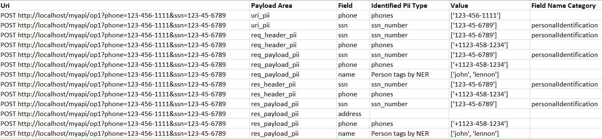

# API PII Analyzer
Analyzing PII in API signature and payload

## Overview
The tool takes a collection of input entries, each contains all the data elements of an API call (i.e. the URI, headers, payload of both the request and the response). It analyzes the data and search for possible private information (PII) by using regular expressions, a black list of suspicious properties names, and named entity recognition (NER) engine.
The result is a CSV or JSON file with a per API call analysis that highlights all the possible private fields and their value. You can use the tool from the command line or call it from your python code. 


Installation
------------
Install from pip using:

    pip install -r requirements.txt


Requirements
-----
* Python 3.6 +
* Java 8 +


The analyzer uses the Stanford Named Entity Recognizer (NER). It can be downloaded [here](http://nlp.stanford.edu/software/CRF-NER.shtml) or just unzip the stanford-ner-2018-10-16.zip available [here](https://nlp.stanford.edu/software/CRF-NER.html#Download). This zip contains both the NER jar file (stanford-ner.jar) and the model file (english.all.3class.distsim.crf.ser.gz). No other installation is required to use the NER engine


Usage
-----

1. Command Line (use defaults)
    ````
    python apiPiiAnalyzer.py
    ````
    default values:
    * **inputFile**: "input.json"
    * **oututFile**: "result.json"
    * **privatePropFile**:  privateProperties.json

2. Command Line (set argumets)
    ````
    python apiPiiAnalyzer.py -i myinput.json -o result.json -r piiRegexs.json -a privateProperties.json -j stanford-ner-2018-10-16/stanford-ner.jar -m stanford-ner-2018-10-16/classifiers/english.all.3class.distsim.crf.ser.gz
    ````
3. Python

    ````
    from apiPiiAnalyzer import ApiPiiAnalyzer
    filepath = '/path/to/your/inputfile.json'
    analyzer = ApiPiiAnalyzer()
    analysis = analyzer.analyze(filepath)
    ````
    #### ApiPiiAnalyzer optional parameters: #### 
     
     * **regexFile**: File path to the json file containing the extra regex expressions that define piis.   
     * **privatePropertiesFile**:  File path to the json file containing the list properties names that should be considered private. (default value: privateProperties.json)
     * **nerModelFileFile**: File path to the NER model file.
     * **nerJarFile**: File path to the NER engine jar.

The results format is determined by the output file extension. If the output file has a 'json' extension results will be persisted as json. If he output file has a 'csv' extension results will be persisted as csv.  

If nerModelFileFile and nerJarFile are left blank the NER engine will not run and the tool will run X60 faster.
****
## Input file

The input file contains a list of records, each captures all requests and response elements as shown below 

Example:
```json
[{
        "uri":"PUT http://localhost/myapi/op3",
        "headers":[
            {"host": "v1"},
            {"agent": "v2"}
        ],
        "body":{"ssn": 1, "n": "123-45-6789"}, 
        "responseHeaders":[
            {"h1": "v1"},
            {"h2": "v2"}
        ],
        "responseBody":{"ssn": 1, "n": "123-45-6789"}, 
}, 
{}]
```
* The body elements of both the request and response supports both string and a json objects.

Example: This examples contains one record with pii in every segment

```json
{
       "uri":"POST http://localhost/myapi/op1?phone=123-456-1111&ssn=123-45-6789",
       "headers":[
           {"ssn": "123-45-6789"},
           {"phone": "+1123-458-1234"}
       ],
       "body":{"adresss": 1, "ssn": "123-45-6789", "phone": "+1123-458-1234", "name": "john lennon"},
       "responseHeaders":[
           {"ssn": "123-45-6789"},
           {"phone": "+1123-458-1234"}
       ],
       "responseBody":{"ssn": "123-45-6789", "address": 6789, "phone": "+1123-458-1234", "name": "john lennon"}        
}
```


## Regular Expression file
With this file, you can introduce more regular expressions and with that define new types of PII that the analyzer will look for. The following are supported out of the box: date, time, phone, phones_with_exts, link, email, ip, ipv6, price, hex color, credit card, btc address, street address, zip code, pob, ssn. If you need to extend this list use the Regular Expression file as an extension point and add new regular expressions.

Example:
```json
[
    {"name" : "frenchPhoneNumber", "expression" : "^(?:(?:\\+|00)33[\\s.-]{0,3}(?:\\(0\\)[\\s.-]{0,3})?|0)[1-9](?:(?:[\\s.-]?\\d{2}){4}|\\d{2}(?:[\\s.-]?\\d{3}){2})$"}
]
```
****
## Private properties file

With this file, you can introduce more property names that should be considered as private data. The analyzer is inspecting all the names of the keys of key-value pairs in the input (e.g. headers) so that it will signal for every key that has a name that suggests the value is private information.

Example:
```json
{
    "address": ["street", "city", "state", "country", "pob", "zip"],
    "phone": ["cellular", "homeNumber", "cellNumber", "officenumber"],
    "mail": ["email"],
    "personalIdentification": ["ssn", "driverlicense"],
    "financial": ["bank", "account", "routingnumber", "creditcard"],
    "ip": ["ipaddress", "ipv6address"]  
}
```
****
## Results file

The results are written to a json or csv file that contains a list of the analytic that was computes for the inputs. One result per one input record. Each result record is identified by the request full uri. It contains the analysis for each part of the input payload (i.e. the uri, headers, payload of both the request and the response)

Example: results of one record that has pii in each segment of the payload as CSV (second input example).




Example: Results for 5 input records each demonstrates analysis of one input record element, as JSON

```json
[
    {
        "id": "GET http://localhost/myapi/op1?phone=123-456-1111",
        "uri_pii": {
            "phone": {
                "phones": [
                    "123-456-1111"
                ]
            }
        }
    },
    {
        "id": "POST http://localhost/myapi/op2",
        "req_header_pii": {
            "n": {
                "ssn_number": [
                    "123-45-6789"
                ]
            },
            "ssn": "paramName_contains-personalIdentification"
        }
    },
    {
        "id": "PUT http://localhost/myapi/op3",
        "req_payload_pii": {
            "ssn": "paramName_contains-personalIdentification",
            "n": {
                "ssn_number": [
                    "123-45-6789"
                ]
            }
        }
    },
    {
        "id": "PUT http://localhost/myapi/op4",
        "res_header_pii": {
            "n": {
                "ssn_number": [
                    "123-45-6789"
                ]
            },
            "ssn": "paramName_contains-personalIdentification"
        }
    },
    {
        "id": "PUT http://localhost/myapi/op5",
        "req_header_pii": {
            "n": {
                "ssn_number": [
                    "123-45-6789"
                ]
            },
            "ssn": "paramName_contains-personalIdentification"
        },
        "res_payload_pii": {
            "ssn": "paramName_contains-personalIdentification",
            "n": {
                "ssn_number": [
                    "123-45-6789"
                ]
            }
        }
    }
]
```


